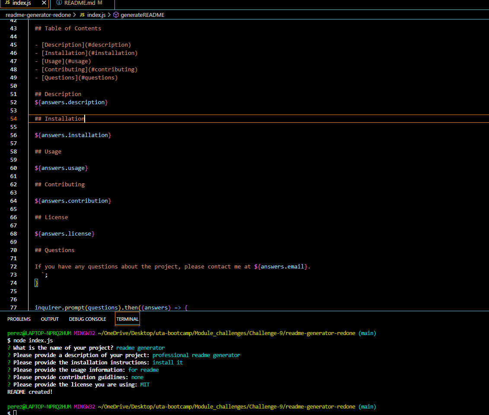

# readme-generator-redone

# Table of Contents
- Description
- Installation
- Usage
- Screenshot
- Walkthrough Video

# Description
Users will be able to use this code to create professional readme files that will describe the work done in their code.

# Installation
- Make sure node.js is install first
- Copy the repo into the terminal or command line
- To start the application in the command line type npm node index.js 

# Usage
Use this code to create a professional readme describing what the code is doing and what the project is.

# Screenshot

# Walkthrough Video:
https://drive.google.com/file/d/1ONOGKav_G8tLUAMp7KCl5AJq3JXQrNIg/view
    